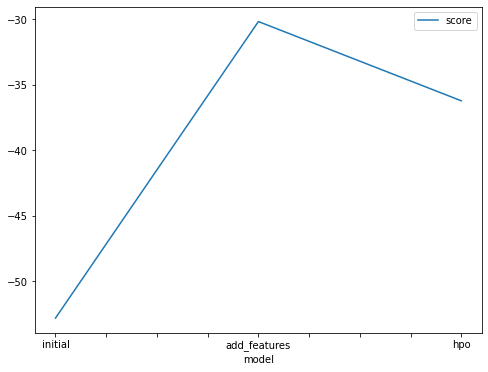
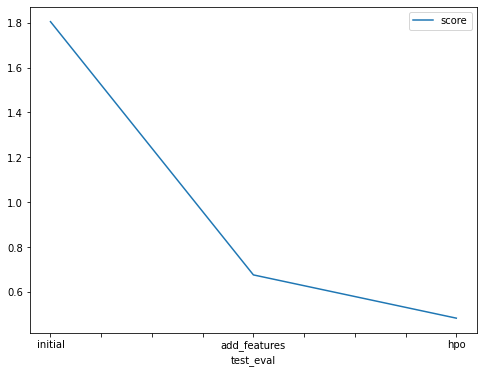

# Report: Predict Bike Sharing Demand with AutoGluon Solution
#### Abdallah Kareem

## Initial Training
### What did you realize when you tried to submit your predictions? What changes were needed to the output of the predictor to submit your results?
TODO: Add your explanation

#### in the first attempt to submit the prediction the score was too high due to not doing exploratory data analysis

### What was the top ranked model that performed?
TODO: Add your explanation

#### the last model with changed hyper parametars

## Exploratory data analysis and feature creation
### What did the exploratory analysis find and how did you add additional features?
TODO: Add your explanation

#### adding extra features by using every element of the date and using the season as a feature as well
### How much better did your model preform after adding additional features and why do you think that is?
TODO: Add your explanation

#### significantly better the score became tha less than half of the first one

## Hyper parameter tuning
### How much better did your model preform after trying different hyper parameters?
TODO: Add your explanation
#### slightly better
### If you were given more time with this dataset, where do you think you would spend more time?
TODO: Add your explanation
Do more analysis and Tuning
### Create a table with the models you ran, the hyperparameters modified, and the kaggle score.
|model|hpo1|hpo2|hpo3|score|
|--|--|--|--|--|
|initial|?|?|?|1.80475|
|add_features|?|?|?|0.67632|
|hpo|?|?|?|0.48355|

### Create a line plot showing the top model score for the three (or more) training runs during the project.

TODO: Replace the image below with your own.

### Create a line plot showing the top kaggle score for the three (or more) prediction submissions during the project.

TODO: Replace the image below with your own.

## Summary
TODO: Add your explanation
#### doing more anaysis and feature extraction and hyperparameter tuning gives better results
